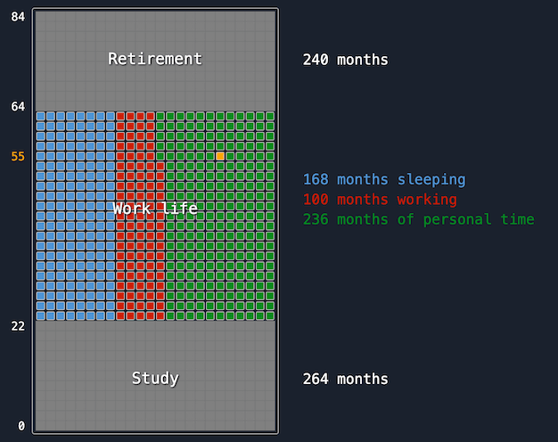

# Time Management

This project is a serie of interactive animations to illustrate how you are spending your time. It is based on the conference on time management and work-life balance "[The Power of the Hourglass](https://laurentpellet.com/le-pouvoir-du-sablier/)" by [Laurent Pellet](https://www.linkedin.com/in/laurent-pellet-france/).

Checkout the live demo in [English](https://evoluteur.github.io/time-management/)
or [French](https://evoluteur.github.io/time-management/index-french.html).

You may also want to take [the time-management test](https://evoluteur.github.io/time-management-test/).

Developed by [Olivier Giulieri](https://evoluteur.github.io/).

(c) 2026 [Laurent Pellet](https://www.laurentpellet.com/)